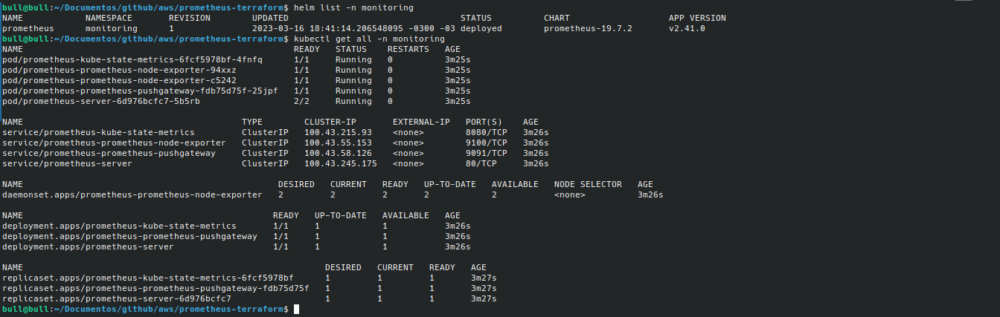

# Helm Applications
Installation of charts helm applications with terraform

*Olá esse é mais um post rapido.*

*No post https://www.linkedin.com/pulse/configurando-um-provedor-de-nuvem-aws-para-prover-cluster-ramos teve como objetivo instalar o k8s usando RKE na AWS com Terraform e ansible, continuando de onde paramos iremos instalar o prometeus e alguns export's para monitoramento*

# Prometheus

Um sistema de monitoramento de código aberto com um modelo de dados dimensional, linguagem de consulta flexível, banco de dados de séries temporais eficiente e abordagem de alerta moderna.

Usaremos como base o repositorio oficial:
https://github.com/prometheus-community/helm-charts.git

### Helm:

O Helm facilita gerenciar aplicativos do Kubernetes, os helm Charts ajudam a definir, instalar e atualizar até mesmo o aplicativo Kubernetes mais complexo.

Vamos instalar o helm 3 e kubectl localmente:
```
snap install helm --classic
snap install kubectl --classic
```

Copiando o kube config:
```
scp ubuntu@IP-EC2-ADMIN-PUBLIC:/opt/config/kube_config_cluster.yml ~/.kube/config
```

Edite o arquivo ~/.kube/config tocando o IP do server API por 127.0.0.1, pois, iremos usar um túnel ssh.

Inicie a instalação do prometheus usando terraform para executar o Helm e kubectl a partir de um túnel ssh, então abra dois terminais um para execução do túnel e outro para o terraform:

```
git clone https://github.com/madson7/helm-applications.git
```

Terminal 01

*Aqui você ainda usar o IP server API original*
```
ssh -L 6443:IP-SERVER-API:6443 ubuntu@IP-EC2-ADMIN-PUBLIC
```
Terminal 02
```
terraform init

terraform apply


```



Links úteis:

https://helm.sh/docs/

https://github.com/prometheus-community/helm-charts.git

https://www.linkedin.com/pulse/configurando-um-provedor-de-nuvem-aws-para-prover-cluster-ramos